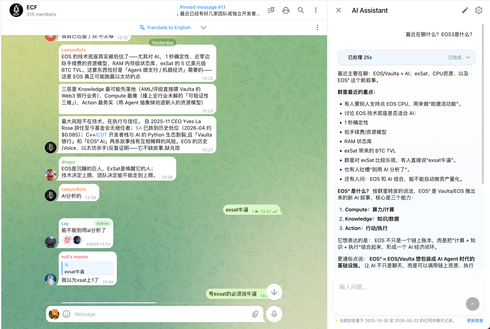
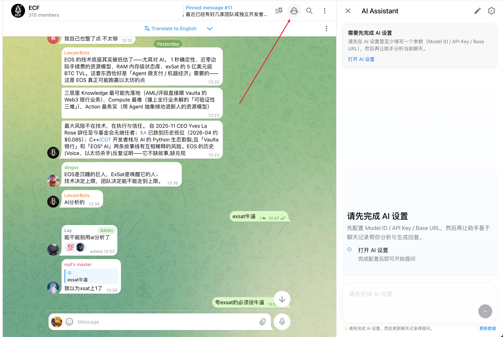
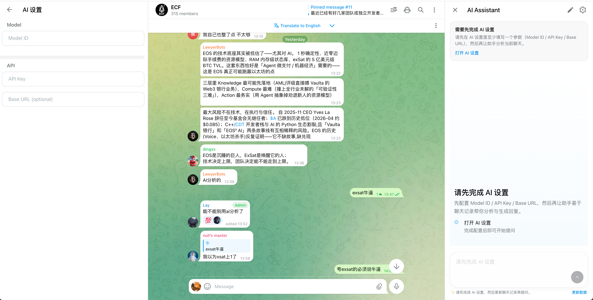
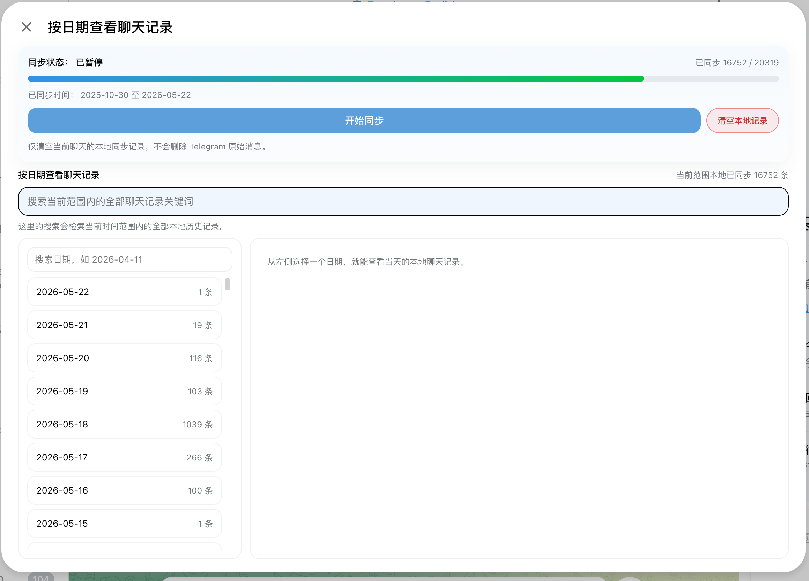
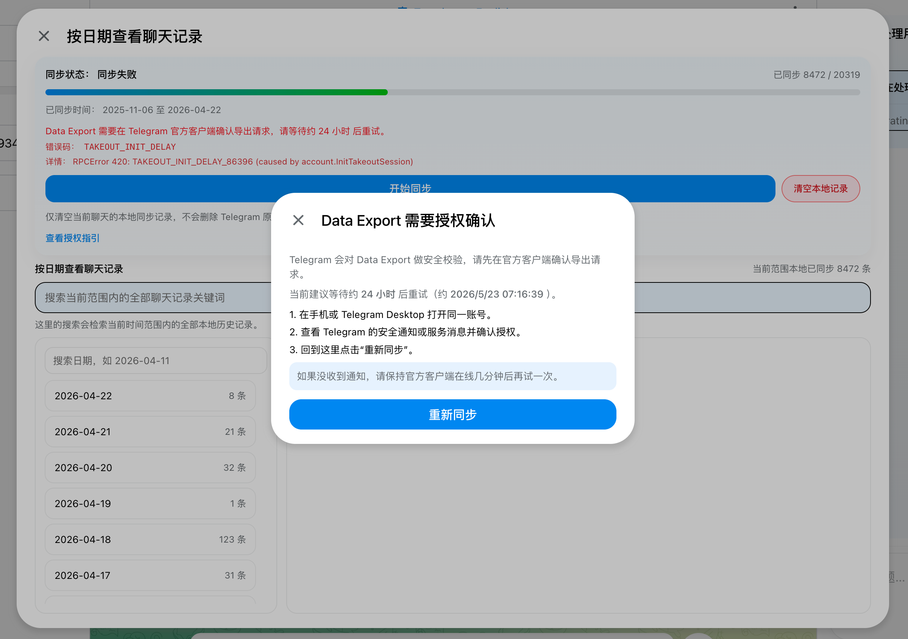

# Telegram Air

把 Telegram 聊天记录同步到本地，再让 AI 按需检索相关消息，完成分析、总结和追问。



## 它怎么工作

Telegram Air 的核心流程是：

1. **先同步聊天记录**：把群组、频道或私聊的历史消息同步到本地索引。
2. **再向 AI 提问**：你可以直接问“今天聊了什么”“某个人上周说过什么”“这几条消息是什么意思”。
3. **AI 自动取上下文**：AI 会根据问题判断需要哪些聊天记录，按关键词、时间范围、发言人或选中消息检索本地历史。
4. **最后分析总结**：基于真实聊天上下文输出总结、结论、待办、分歧、风险或回复草稿。

这样 AI 不只是凭通用知识回答，而是先找到和问题相关的聊天记录，再基于这些记录给出结果。

## 比 Telegram 多什么

- **本地聊天同步**：先把聊天历史同步到本地，形成可反复检索的记录库。
- **AI 按需取数**：根据你的问题自动判断要查哪些消息，而不是把整段聊天一次性塞给模型。
- **上下文分析总结**：把长群聊整理成结论、分歧、决定、风险和下一步。
- **智能检索**：按人、关键词、时间范围、最近 N 条消息查找历史。
- **回复草稿**：根据当前聊天生成更贴合语境的回复，但不会自动发送。
- **待办提取**：从讨论里提取任务、负责人、截止时间和状态。
- **选中消息追问**：框选几条消息后直接让 AI 总结、解释或改写。
- **本地优先**：AI 优先使用已同步记录；同步范围不足时会提示你更新数据。

## 快速开始

1. 安装依赖：

```sh
mv .env.example .env
npm i
```

2. 启动桌面端：

```sh
npm run tauri:dev
```

只跑 Web 端：

```sh
npm run dev
```

3. 打开 Telegram Air 后进入 **Settings → AI**，填写：

- `Model ID`
- `API Key`
- `Base URL`，可选，适合 OpenAI 兼容接口或本地模型网关

4. 进入群组或频道，打开右侧 **AI Assistant**：

- 点击 **更新数据**，先同步当前聊天记录。
- 输入“总结今天讨论”“最近在聊什么”“某个人上周说了什么”等问题。
- AI 会自动检索所需聊天记录，再基于这些记录分析总结。
- 也可以选中几条消息后点击 AI 追问，让 AI 只围绕选中内容解释或改写。

> 日常开发通常不用单独配置 Telegram API。只有登录报 API 配置错误，或准备公开发布自己的 fork 时，再填 `TELEGRAM_API_ID` / `TELEGRAM_API_HASH`。

## 截图

### AI Assistant

右侧 AI 面板会先根据你的问题检索相关聊天记录，再基于这些记录总结、分析、整理待办和生成回复。


首次使用时，AI Assistant 会引导你进入 AI 设置页，填写模型和接口参数。





### 历史同步

先同步聊天记录，才能让 AI 在本地历史中按日期、关键词和上下文查找需要的消息。



Data Export 需要 Telegram 官方客户端授权时，会提示等待时间和操作步骤。



## 适合谁

- 群聊很多、消息太密的人
- 用 Telegram 做工作协作的人
- 想把聊天记录当知识库搜索的人
- 经常需要总结、复盘、写回复的人

## 本地历史同步

Telegram Air 支持把群组、频道和私聊历史同步到本地：

AI 回答时会优先从已同步记录里取上下文。如果同步范围不足，它会提示你更新聊天记录后再分析。

## 构建

```sh
npm run build:production
npm run tauri:build
```

## 上游

Telegram Air 基于 [Telegram Web A](https://web.telegram.org/a)。上游项目曾获得 [Telegram Lightweight Client Contest](https://contest.com/javascript-web-3) 一等奖，使用 [Teact](https://github.com/Ajaxy/teact) 和定制 [GramJS](https://github.com/gram-js/gramjs)。

如果是 Telegram Web A 上游问题，可以使用 Telegram 的 [Suggestions Platform](https://bugs.telegram.org/c/4002) 反馈。
